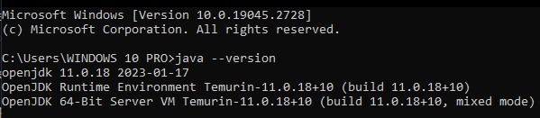

# Nabenik's Enterprise Java basic test

Hi and welcome to this test. As many technical interviews, main test objective is to establish your actual Enterprise coding skills, being:

* Java knowledge
* DDD knowledge
* General toolkits, SDK's and other usages
* Jakarta EE general skills

This repository is a [GitHub template](https://docs.github.com/en/repositories/creating-and-managing-repositories/creating-a-repository-from-a-template), from which you have to create your own repository, fix the source code if required, add your answers to readme file, commit the solutions/answers to YOUR copy.

This document is structured using [GitHub Markdown Flavor](https://github.com/adam-p/markdown-here/wiki/Markdown-Cheatsheet#code).

## General questions

1. How to answer these questions?

> Like this

Or maybe with code

```kotlin
fun hello() = "world"
```

2. Please describe briefly the main purpose for the following Jakarta EE specs, also add in your answer http links to actual implementations. Is this project using all specs?

- EJB
- Servlet
- CDI
- JAX-RS

### Respuesta
<p align="justify">Anteriormente conocido como Java Enterprise Edition, es un conjunto de estandares que se utilizan para crear aplicaciones empresariales basadas en Java.</p>

#### Especificaciones
<ul>
    <li><p align="justify"><b>EJB</b>:Define un modelo de programacion de componentes para la creacion de aplicaciones empresariales en java. Ejemplo: <a href="https://tomee.apache.org/"> Apache TomEE</a></p></li>
    <li><p align="justify"><b>servlet</b>:De manera simple, un servlet es un componente web a nivel de Java EE, tratandose de una clase que genera una pagina HTML. Ejemplo: <a href="https://tomcat.apache.org/"> Apache Tomcat</a></p></li>
    <li><p align="justify"><b>CDI</b>:Define como se debe crear y administrar objetos, inyectando dependencias para el control de objetos y administrar los ciclos de vida de los objetos. Ejemplo:<a href="https://weld.cdi-spec.org/"> Weld</a></p></li>
    <li><p align="justify"><b>JAX-RS</b>:Estructura como crear servicios web RESTful en Java. Osea nos da un manera sencilla de implementar servicios web. Ejemplo:<a href="https://eclipse-ee4j.github.io/jersey/"> Jersey</a></p></li>
</ul>

<p align="justify">No es que sea necesario usar todas las especificaciones, seran utilizada solo en base a las necesidades que se presenten en cada proyecto.</p>

3. Which of the following is an application server?

* Open Liberty
* Apache TomEE
* Eclipse Jetty
* Eclipse Glassfish
* Oracle Weblogic

<p align="justify">Tanto Apache TomEE, como Eclipse Glassfish y Oracle Weblogic, son servidores de aplicaciones, Libertad abierta es un tiempo de ejecucion de aplicaciones de Jakarta EE, y Embarcadero de eclipse es una herramienta de desarrollo de software. Por lo tanto: <b>Apache TomEE, Eclipse Glassfish, y Oracle Weblogic</b>, son servidores de aplicaciones.</p>

4. In your opinion, what's the main benefit of moving from Java 11 to Java 17?

<p align="justify">Primero seria que Java 17 es el sucesor de Java 11 como versiones LTS, esto lo que me dice es que Java 17, trae nuevas caracteristicas, e implementaciones, que Java 11, no posee, El principal beneficio que existe es practicamente las mejoras que trae.</p>

5. Is it possible to run this project (as is) over Java 17? Why?

<p align="justify">Podria llegar a ejecutarse, pero tendria errores, y por temas de adaptabilidad Java 17, debería de ser capaz de correr la aplicación en caso de que este correctamente elaborada.</p>

6. Is it possible to run this project with GraalVM Native? Why?

<p align="justify">Es una herramienta que puede compilar programas de Java, asi como otros lenguajes de programación en binarios y pueden ser ejecutados directamente en el S.O., y no es necesario tener una JVM. Pero, GraalVM solo es para compilar proyectos de Java, para ejecutarlos se debe utilizar la herramienta GraalVM Native Image, que es una herramienta de línea de comandos, compilando la aplicacion Java, para luego ser ejecutados directamente en un S.O.</p>

7. How do you run this project directly from CLI without configuring any application server? Why is it possible?

<p align="justify">Por lo que investigue y sé, es que si se puede ejecutar este proyecto directamente desde la línea de comandos (CLI), ya que al compilar el proyecto se empaqueta en un archivo ejecutable, bien en el caso de Java, se genera un jar.</p>

```java
java -jar back-test.jar
```

<p align="justify">En el ejemplo de arriba se muestra como podría ejecutarse la aplicación empaquetandose en un jar, ahora esto se puede realizar con apps pequeñas, pero me imagino que con proyectos mas grandes se debe de considerar no realizarlo, ya que utilizar solo la <b>CLI</b>, no integra herramientas que algún servidor de aplicaciones, nos puede brindar.</p>

## Development tasks

To solve this questions please use Gitflow workflow, still, your answers should be in the current branch.

Please also include screenshots on every task. You don't need to execute every task to submit your pull request but feel free to do it :).

0. (easy) Show your terminal demonstrating your installation of OpenJDK 11

<p align="justify">A continuación la instalación OpenJDK 11:</p>
<p align="center">  </p>

1. (easy) Run this project using an IDE/Editor of your choice

2. (medium) Execute the movie endpoint operations using curl, if needed please also check/fix the code to be REST compliant

3. (medium) Write an SPA application using Angular, the application should be a basic CRUD that uses Movie operations, upload this application to a new Bitbucket repo and include the link as answer

4. (medium) This project has been created using Java EE APIs, please move it to Jakarta EE APIs and switch it to a compatible implementation (if needed)

5. (hard) Please identify the Integration Test for `MovieRepository`, after that implement each of the non-included CRUD methods

6. (hard) Please write the Repository and Controller for Actor model, after that implement each of the CRUD methods using an Integration Test

7. (hard) This project uses vanilla Java EE for Database Persistence, please integrate Testcontainers with MySQL for testing purposes

8. (nightmare) This source code includes only Java EE APIs, hence it's possible to port it to [Open Liberty](https://openliberty.io/). Do it and don't port Integration Tests 

